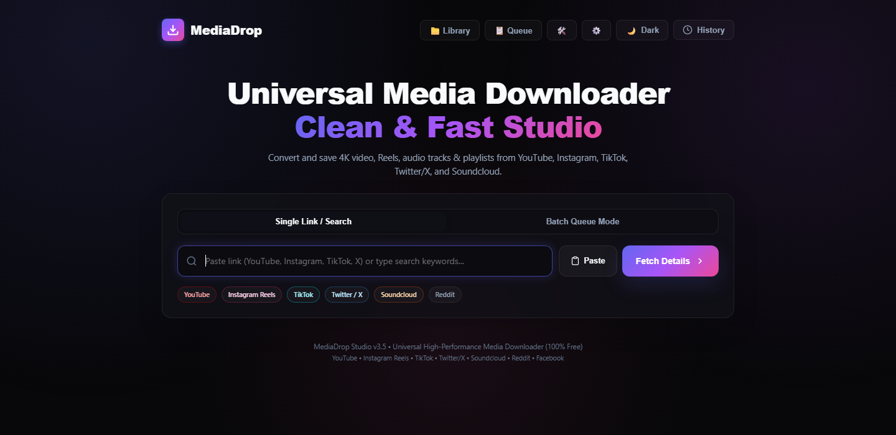

# MediaDrop Studio


MediaDrop Studio is a local-first web and desktop application for downloading, converting, organizing, and previewing media with [yt-dlp](https://github.com/yt-dlp/yt-dlp) and FFmpeg. It supports single links, YouTube search, playlists, batch jobs, audio conversion, GIF creation, subtitles, trimming, SponsorBlock, presets, download history, and a local media library.

> Use MediaDrop only for media you own, public-domain or Creative Commons media, and content you have permission to download. The app does not bypass platform access controls or DRM.

## Contents

- [Screenshot](#screenshot)
- [Highlights](#highlights)
- [Requirements](#requirements)
- [Windows setup](#quick-start-on-windows)
- [Ubuntu/Debian setup](#quick-start-on-ubuntu-or-debian)
- [macOS setup](#quick-start-on-macos)
- [How to use MediaDrop](#how-to-use-mediadrop)
- [Queue, history, presets, and library](#queue-history-presets-and-library)
- [Keyboard shortcuts](#keyboard-shortcuts)
- [Desktop application](#desktop-application)
- [Docker](#docker)
- [Storage and privacy](#storage-and-privacy)
- [API overview](#api-overview)
- [Troubleshooting](#troubleshooting)
- [Development and tests](#development-and-tests)
- [Security and deployment](#security-and-deployment)
- [Legal notice](#legal-notice)

## Screenshot



## Highlights

- Download from supported YouTube, Instagram, TikTok, Twitter/X, Reddit, SoundCloud, Facebook, Vimeo, Twitch, and Pinterest URLs.
- Search YouTube directly by entering keywords instead of a URL.
- Export video as MP4 at up to 4K when the source provides that quality.
- Extract audio as MP3, M4A, or WAV at 128, 192, or 320 kbps.
- Create trimmed GIFs from video.
- Process up to 10 URLs in a batch and package multiple results as a ZIP archive.
- Select individual playlist items, enter ranges such as `1,3,5-10`, or skip short/long entries.
- Download subtitles, extract searchable transcripts, and save YouTube thumbnails.
- Preview SponsorBlock segments before removing or marking them.
- Follow live download percentage, speed, ETA, processing stages, and a speed graph.
- Cancel jobs, retry failures, use quick presets, and manage multiple active jobs in the queue.
- Browse completed files in grid or list view and preview supported video, audio, image, and GIF files.
- Configure themes, animations, default format, default quality, notifications, and completion sound.
- Use the command palette and keyboard shortcuts for fast navigation.
- Run as a browser app, a PyWebView desktop app, or a Docker container.

Platform support ultimately depends on the current yt-dlp extractor and the media provider. Websites can change without notice, so keep yt-dlp updated.

## Requirements

| Requirement | Purpose |
| --- | --- |
| Python 3.10+ | Flask backend, job processing, and desktop launcher |
| FFmpeg and ffprobe | Video/audio merging, conversion, trimming, normalization, and GIF creation |
| A yt-dlp-supported JavaScript runtime | Required for reliable YouTube extraction; Node.js or Deno is recommended |
| Modern browser | Chrome, Edge, Firefox, or another current browser |
| Browser account session (optional) | Media your account is authorized to access |

Verify the main dependencies:

```text
python --version
ffmpeg -version
ffprobe -version
node --version
python -m yt_dlp --version
```

## Quick start on Windows

Open PowerShell in the project directory:

```powershell
winget install --id Gyan.FFmpeg.Essentials --exact

py -3 -m venv .venv
.\.venv\Scripts\Activate.ps1
python -m pip install --upgrade pip
python -m pip install -r requirements.txt
python app.py
```

Open <http://127.0.0.1:5000>.

If PowerShell blocks virtual-environment activation, allow it for the current terminal only:

```powershell
Set-ExecutionPolicy -Scope Process Bypass
.\.venv\Scripts\Activate.ps1
```

Install a current Node.js or Deno release separately if the diagnostics panel reports that no supported JavaScript runtime is available.

## Quick start on Ubuntu or Debian

```bash
sudo apt update
sudo apt install -y python3-venv ffmpeg

python3 -m venv .venv
source .venv/bin/activate
python -m pip install --upgrade pip
python -m pip install -r requirements.txt
python app.py
```

Install a current Node.js or Deno runtime, then open <http://127.0.0.1:5000>.

## Quick start on macOS

With Homebrew installed:

```bash
brew install python ffmpeg node

python3 -m venv .venv
source .venv/bin/activate
python -m pip install --upgrade pip
python -m pip install -r requirements.txt
python app.py
```

Open <http://127.0.0.1:5000>.

## How to use MediaDrop

### Download a single item

1. Open **System diagnostics** from the top navigation and confirm that FFmpeg, ffprobe, yt-dlp, and a JavaScript runtime are available.
2. Paste a supported media URL into the main field. You can also enter search keywords to search YouTube.
3. Select **Fetch Details**.
4. Review the title, creator, duration, publication date, thumbnail, available qualities, captions, and playlist information.
5. Choose **Video**, **Audio**, or **GIF**.
6. Select the required quality, audio format, bitrate, subtitles, trimming, and other optional processing controls.
7. Select **Start Conversion**.
8. Follow the live progress panel. You can leave the job running in the queue or cancel it.
9. When processing finishes, select **Save File**. The browser saves the final copy using its normal download settings.

### Download multiple links

1. Switch to **Batch Queue Mode**.
2. Paste one supported URL per line, up to 10 URLs.
3. Select **Process Batch Queue**.
4. MediaDrop downloads valid entries using the current default conversion settings.
5. Multiple completed files are returned in one ZIP archive. Failed or inaccessible entries are listed separately instead of stopping the entire batch.

### Download a playlist

1. Paste a playlist URL and fetch its details.
2. Enable **Full Playlist**.
3. Use **All**, **None**, the item checkboxes, or a range such as `1,3,5-10`.
4. Optionally use **Skip Shorts** or **Skip Long** to filter the selection.
5. Choose the output format and start the conversion.

The picker displays up to the first 50 extracted playlist entries. Multi-file results are packaged into a ZIP archive.

### Video options

- Quality choices range from 144p through 2160p when those formats are available.
- **Best available** lets yt-dlp select the highest-quality streams.
- Higher-resolution YouTube downloads usually require FFmpeg because video and audio are delivered as separate streams.
- **SponsorBlock** can remove supported sponsor, intro, outro, and self-promotion segments or mark them as chapters.
- **Clip Time Range** accepts seconds, `MM:SS`, or `HH:MM:SS` values.
- **Include Subtitles** saves the selected caption language as VTT when available.

### Audio and GIF options

- Audio containers: MP3, M4A, and WAV.
- Audio bitrates: 128, 192, and 320 kbps. The result cannot exceed the quality of the original source.
- Optional loudness normalization and speed/pitch effects are processed with FFmpeg.
- GIF mode creates a 12 FPS GIF scaled to a maximum width of 480 pixels from a source up to 720p.
- Use a short clip range for GIFs; long high-resolution GIFs can become very large.

### Private and age-restricted media

MediaDrop cannot bypass access restrictions. If your account is authorized:

1. Sign in to the media provider using Chrome, Edge, Firefox, or Brave.
2. Select that browser under **Browser Cookies (Private Media)** before fetching details.
3. If cookie reading fails, close the browser completely and retry. Firefox is often a useful fallback.

The selected browser session is read locally by yt-dlp and is not exported into MediaDrop's database. The session is still sent to the media provider as part of the authorized request.

## Queue, history, presets, and library

- **Queue** shows current-session jobs and lets you monitor or cancel them.
- **History** stores up to 15 recent items in the browser and supports title/creator search and re-fetching.
- **Presets** provide ready-made settings such as 1080p MP4, podcast MP3, audio-only, and GIF. Open the command palette with `Ctrl+K` / `Cmd+K`, then search for **Open Presets**.
- **Library** lists completed files from the current server session, supports search, grid/list layouts, preview, download, single deletion, and multi-selection deletion.
- **Settings** stores theme, animation, quality, format, bitrate, auto-fetch, notification, and completion-sound preferences in the browser.

Interrupted downloads do not resume after the server restarts. The in-memory queue and library are also rebuilt for each server session.

## Keyboard shortcuts

| Shortcut | Action |
| --- | --- |
| `/` | Focus the URL input |
| `Ctrl+K` / `Cmd+K` | Open the command palette |
| `Ctrl+Enter` / `Cmd+Enter` | Fetch details or start the current conversion |
| `Ctrl+H` / `Cmd+H` | Toggle history |
| `Ctrl+D` / `Cmd+D` | Open diagnostics |
| `Ctrl+Shift+T` / `Cmd+Shift+T` | Toggle the theme |
| `?` | Show shortcut help |
| `Escape` | Close the active modal or request cancellation of an active job |

The command palette can also switch modes, apply themes, open settings/presets/library, repeat the last download, start quick MP3/MP4 conversions, purge storage, and clear history.

## Desktop application

The PyWebView launcher starts the Flask backend on a free local port and opens MediaDrop in a native window:

```powershell
.\.venv\Scripts\Activate.ps1
python desktop.py
```

### Build the Windows executable

```powershell
.\.venv\Scripts\Activate.ps1
python -m pip install pyinstaller waitress
python build_exe.py
```

The executable is created at `dist/MediaDropStudio.exe`.

The current one-file build packages the application code and UI. FFmpeg, ffprobe, and a supported JavaScript runtime must still be installed on the target computer and available through `PATH` unless you customize the build to bundle them.

## Docker

Build the image:

```bash
docker build -t mediadrop-studio .
```

Run it on localhost only:

```bash
docker run --rm -p 127.0.0.1:5000:5000 mediadrop-studio
```

To keep the server-side download cache between containers on Linux/macOS:

```bash
docker run --rm -p 127.0.0.1:5000:5000 \
  -v "$PWD/downloads:/app/downloads" \
  mediadrop-studio
```

The final file still needs to be saved through the browser. Do not expose the container publicly without the protections listed in [Security and deployment](#security-and-deployment).

## Storage and privacy

| Data | Location |
| --- | --- |
| Working and completed server files | `downloads/<job-id>/` |
| Jobs and saved presets | `mediadrop.db` |
| UI settings and recent browser history | Browser `localStorage` |
| Final saved copy | The browser's configured download location |

- The automatic cleanup worker checks hourly for inactive download folders older than 24 hours.
- **Purge Download Cache** removes cached server files but does not remove copies already saved by your browser.
- Deleting files from the library or purging storage is permanent.
- Transcript extraction contacts the source provider; SponsorBlock previews contact the SponsorBlock API.
- The phone QR action is intended for a LAN-accessible deployment. The default `127.0.0.1` server cannot be reached from another device.

Set `FFMPEG_LOCATION` if FFmpeg is installed outside `PATH`:

```powershell
$env:FFMPEG_LOCATION = "C:\path\to\ffmpeg.exe"
python app.py
```

## API overview

| Endpoint group | Purpose |
| --- | --- |
| `POST /api/info` | Analyze a URL or perform a YouTube search |
| `POST /api/jobs` | Start a single conversion job |
| `POST /api/batch_jobs` | Start a batch of up to 10 URLs |
| `GET/DELETE /api/jobs/<id>` | Read status or request cancellation |
| `GET /api/jobs/<id>/events` | Receive real-time progress using server-sent events |
| `GET /api/jobs/<id>/file` | Download a completed result |
| `GET /api/jobs/<id>/preview` | Read completed-file preview metadata |
| `/api/presets` | List, create, and delete saved presets |
| `/api/library` | List and delete current-session completed files |
| `/api/diagnostics`, `/api/health`, `/api/stats` | Inspect dependencies, health, disk usage, and job totals |
| `/api/transcript`, `/api/thumbnail`, `/api/sponsorblock_segments` | Supporting media tools |

The API is designed for the bundled local UI. It is not an authenticated public service.

## Updating yt-dlp

Use **Update Engine** inside System Diagnostics, or update manually:

```text
python -m pip install --upgrade "yt-dlp[default]"
```

Restart MediaDrop after updating. Website extractor fixes are released frequently.

## Troubleshooting

### FFmpeg or ffprobe is missing

Run `ffmpeg -version` and `ffprobe -version` in the same terminal used to start MediaDrop. Restart the app after changing `PATH`, or set `FFMPEG_LOCATION` explicitly.

### 1080p, 1440p, or 4K is unavailable

Confirm FFmpeg and a supported JavaScript runtime are available, update yt-dlp, and fetch the media details again. The source must actually provide the requested resolution.

### YouTube reports a signature, player, or extraction error

Update yt-dlp and confirm `node --version` or your chosen supported runtime works. Then restart MediaDrop.

### Browser cookies cannot be read

Close the selected browser completely and retry. Confirm you selected the browser containing the authorized account session.

### Port 5000 is already in use

Install Waitress and choose another local port:

```text
python -m pip install waitress
python -m waitress --listen=127.0.0.1:5050 app:app
```

Then open <http://127.0.0.1:5050>.

### A conversion is slow or appears stuck

Large playlists, 4K merging, WAV conversion, GIF creation, SponsorBlock processing, and forced keyframes for precise trimming can take significant CPU, disk space, and time. Check the pipeline message, free disk space, and diagnostics panel before canceling.

## Development and tests

Run the test suite from the activated virtual environment:

```text
python -m unittest -v
```

The project currently includes 40 unit and API tests covering validation, downloads, playlists, storage, presets, previews, SSE progress, rate limiting, cleanup, diagnostics, and failure handling.

Optional lint and formatting setup:

```text
python -m pip install ruff pre-commit
ruff check .
ruff format --check .
pre-commit install
```

## Project structure

```text
.
├── app.py                  # Flask routes, yt-dlp jobs, progress, and APIs
├── storage.py              # SQLite jobs, history, and presets
├── templates/index.html    # Main application markup
├── static/
│   ├── app.js              # UI state, queue, library, settings, and interactions
│   ├── style.css           # Responsive themes and component styles
│   ├── manifest.json       # Installable web-app metadata
│   └── sw.js               # Static application-shell cache
├── desktop.py              # Native PyWebView launcher
├── build_exe.py            # Windows PyInstaller build script
├── Dockerfile              # Container image
├── test_app.py             # Unit and Flask API tests
└── docs/images/            # README screenshots
```

## Security and deployment

MediaDrop is designed for one trusted user on a local machine. Keep it bound to localhost.

Before any shared, LAN-wide, or public deployment, add authentication, CSRF protection, HTTPS, strict origin controls, per-user job isolation, stronger rate limits, a persistent job queue, playlist and file-size limits, disk quotas, scheduled retention, and a reverse proxy. Review the cookie-login, engine-update, file-deletion, and download endpoints especially carefully.

## Legal notice

You are responsible for following copyright law, the media provider's terms, and any license attached to the content. MediaDrop cannot grant rights to media and should not be used to bypass paywalls, DRM, private access controls, or geographic restrictions.
